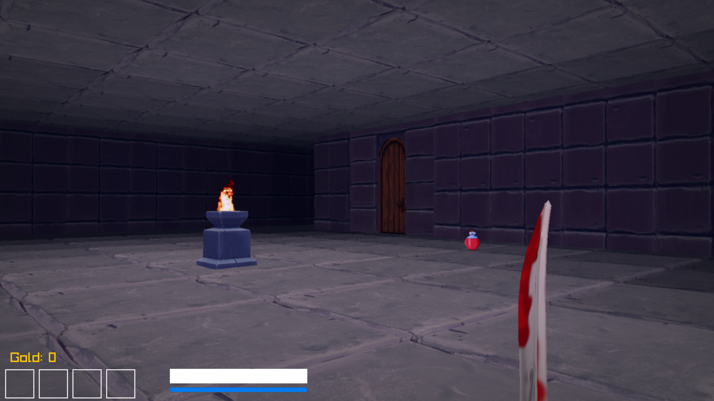

# Marooned

Marooned is a first-person exploration/survival game with procedural terrain and dungeon elements. Built in C++ with Raylib. Explore a chain of mysterious tropical islands teeming with danger, lost ruins, and ancient secrets.


---

## 🌴 Features

- 🏝️ **Procedural Terrain**  
  Generate vast island landscapes from 4K perlin noise heightmaps.

- 🗺️ **Procedural dungeons** 
  generation based on PNG blueprints.

- 🧍 **First-person on-foot controller**

- 🚣 **First-person boat controller**

- 🦕 **Wandering dinosaurs**
   patrol, chase, and runaway behavior.

- 🌤️ **Dynamic Skybox**  
  A seamless, procedurally rendered sky with soft, animated clouds.

- 🌊 **Animated Water Shader**  
  Realistic water distortion with distance-based gradients for added depth.

- 🌲 **Vegetation System**  
  Procedurally placed palm trees with randomized scale, rotation, and offsets.  
  Tree placement is filtered by terrain height and spacing rules.

- 🌫️ **Ambient Occlusion Shader**  
  Screen-space AO gives a subtle cell-shaded look to island edges.

- 🧭 **Free Camera Navigation**  
  Navigate freely over the landscape or plan for a 3rd-person boat cam.

- 🔊 **Jungle ambiance**
  Footstep sounds, raptor cries

---

## 🛠 Built With

- [Raylib](https://www.raylib.com/) - Simple and powerful C/C++ game framework  
- C++17 - All game logic and rendering code written from scratch  
- GLSL - Custom shaders for water, lighting, sky, and post-processing  

---

## 🎮 Running the Game

To build and run:

```bash
make
./game.exe
