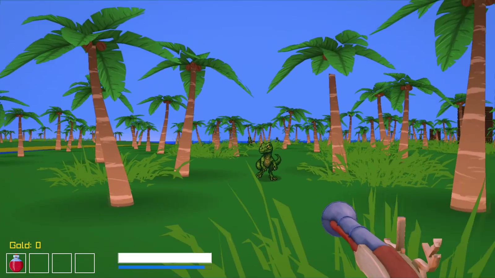
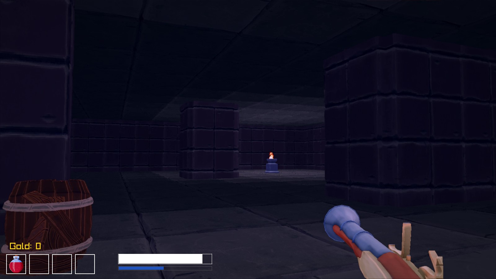

# Marooned  

**Marooned** is a first-person adventure/shooter set in pirate times on a chain of Caribbean islands. The game combines open-world exploration with dungeon crawling, built in **C++** using **Raylib 5.5**. 

## Features  

- 🌴 **Overworld Exploration**  
  - Islands generated from a **grayscale heightmap**  
  - Procedural vegetation (trees, bushes)  
  - Dynamic water and post-processing shaders  

- 🏰 **Dungeon Crawling**  
  - Dungeons generated from **PNG images**  
    - White pixels → floor tiles  
    - Black pixels → walls  
    - Special colored pixels mark **entrances/exits/doors**  
  - Tile-based wall/floor models with baked lighting  
  - 2D billboard enemies (pirates, raptors, ghosts, etc.)  

- ⚔️ **Combat System**  
  - Melee weapons (sword)  
  - Firearms and special weapons (ray gun)  
  - Enemies with different AI behaviors (chase, flee, wander)  

- 🎮 **Player Controller**  
  - Switchable **free camera** / **first-person player mode**  
  - Swimming and boat-riding support  

## Tech Notes  

- Built with **C++17** and **Raylib 5.5**  
- Uses modular code structure (`player.cpp`, `world.cpp`, `dungeonGeneration.cpp`, etc.)  
- Shader-based effects (fog, AO, foliage alpha, fullscreen distortion)  
- Development in **VS Code** with Makefile builds  

