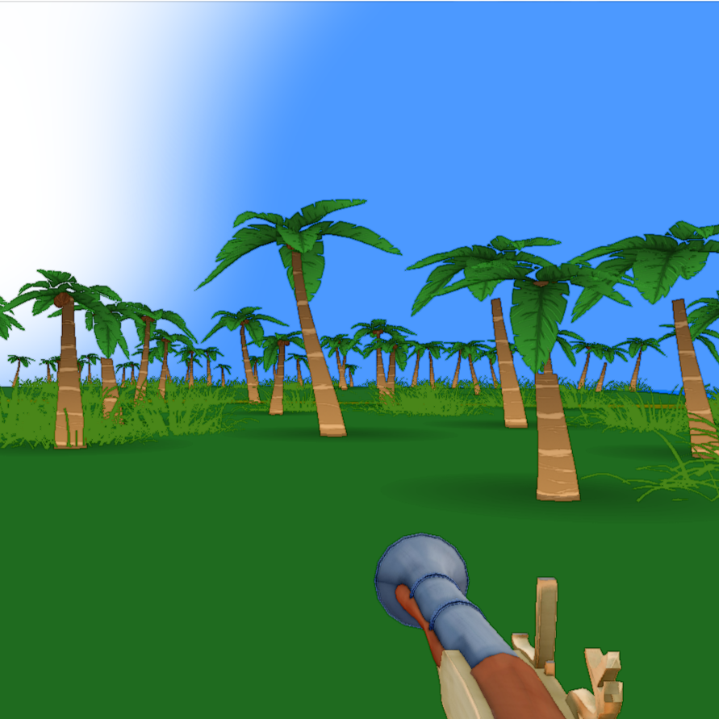

# Marooned

Marooned is a first-person exploration/survival game with procedural terrain and dungeon elements. Built in C++ with Raylib. Explore a chain of mysterious tropical islands teeming with danger, lost ruins, and ancient secrets.


---

🧩 Features

🌍 Procedural Terrain
Generates large island environments from grayscale heightmaps.

Realistic terrain shading using a custom terrain shader and ambient occlusion.

Dynamic sky and animated water complete the atmosphere.

🌿 Vegetation System
Palm trees and bushes are procedurally placed and vary in size and shape.

Includes basic collision for navigation and interaction.

Supports environmental interaction (bullets can hit and react with trees).

🧍 First-Person Player Mode
Toggle between free-fly camera and grounded player mode (TAB key).

Player can sprint, swim, and interact with the world.

Health and stamina systems visualized through clean on-screen UI.

🧠 AI System
Raptors roam the island or inhabit dungeons.

Uses a shared Character class with state-based logic (idle, chase, attack, flee).

Enemies avoid terrain and interact with trees and walls.

🔫 Combat & Projectiles
Bullets can be fired and interact with characters, walls, and trees.

Decals (blood, smoke) are dynamically created on impact.

Bullet lights briefly illuminate surroundings for added visual flair.

🏰 Dungeon Mode
Switches game context into a handcrafted dungeon generated from PNG maps.

Rooms, walls, barrels, and lights created at runtime.

Separate ambient audio and lighting for underground tension.

📷 Custom Render Pipeline
Offscreen framebuffer for scene rendering.

Fullscreen post-processing via a fog shader.

Custom camera matrix setup for maximum control.

🎧 Audio
Ambient jungle and dungeon soundscapes using Raylib music streams.

Basic sound manager system for playing SFX.

Planned support for positional audio and reverb zones.

---

## 🛠 Built With

- [Raylib](https://www.raylib.com/) - Simple and powerful C/C++ game framework  
- C++17 - All game logic and rendering code written from scratch  
- GLSL - Custom shaders for water, lighting, sky, and post-processing  

---

## 🎮 Running the Game

To build and run:

```bash
make
./game.exe
