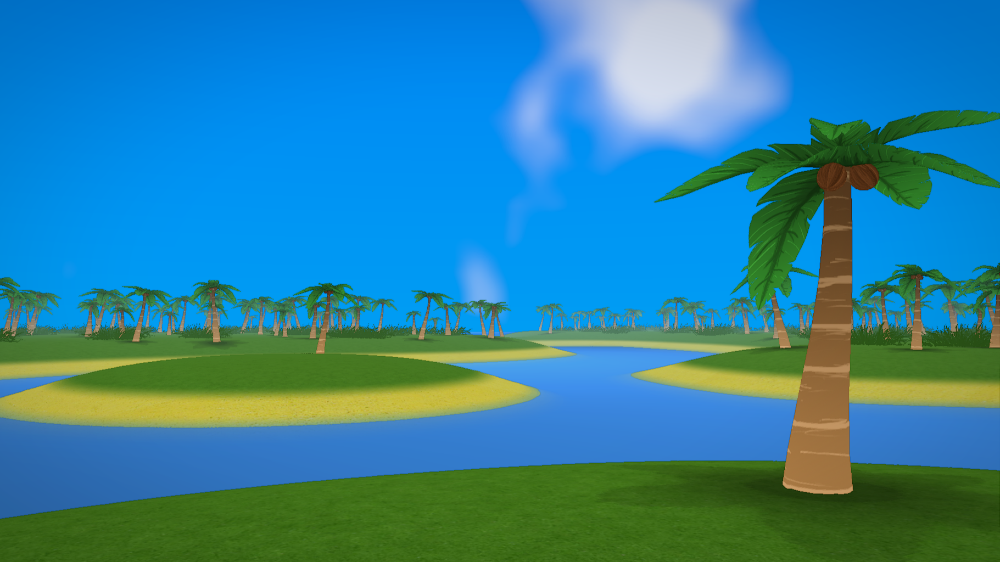

# Marooned

**Marooned** is a 3D FPS adventure dungeon crawler set in the 1700s pirate era on a chain of Caribbean islands. The player is marooned on an island with only a sword, a blunderbuss and a health potion. They have to go through multiple dungeons and fight a boss to escape.


### Table of Contents
- [Features](#features)
- [Installation](#installation)
- [Usage](#usage)
- [Contributing](#contributing)
- [License](#license)

## Features
- Combat with a blunderbuss, sword and a magic staff.
- Multiple enemies with unique AI.
- Dungeons.
- Collectible potions and gold.
- A boss at the end of the game.

## Installation
#### Prerequisites
You must install git, make (or cmake), a c++ compiler and raylib 5.5.
#### Install Steps
1. Clone the repository:
```bash
git clone https://github.com/Acerx-AMJ/Marooned.git
```

2. Navigate to the repository:
```bash
cd Marooned
```

3. Build the project with Make:
```bash
make
```

Or alternatively, with CMake:
```bash
cmake -B build
cmake --build build
```

The executable can be found in `build/marooned` or `build/marooned.exe`. If something didn't work, please open an issue.

## Usage
Simply run the executable file after building. The `assets` folder must be in the same folder in which the executable is run.

## Contributing
Feel free to create PRs or issues. To create a PR:

1. Fork the repository.
2. Create a new branch:
```bash
git checkout -b feature-name
```
3. Make your changes.
4. Push your branch:
```bash
git push origin feature-name
```
5. Create a pull request and describe made changes.

## License
This project is licensed under the [MIT License](LICENSE.txt). Feel free to use, copy, modify, distribute and sell this project.
